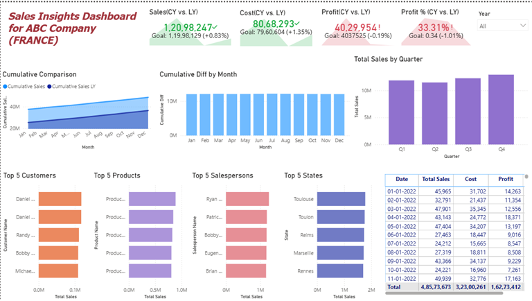

# Sales Insights Dashboard – ABC Company (France)

## Project Overview

This Power BI portfolio project analyses sales performance for a fictional company operating across France. The report covers transactions from **2022 to 2025** and provides an executive view of sales, cost, profit, profitability, year-over-year performance, and the strongest customers, salespeople, products, and locations.

## Business Objectives

The dashboard was developed to answer the following questions:

- How are sales, cost, profit, and profit margin performing compared with the previous year?
- How does cumulative sales performance change month by month?
- Which quarters generate the strongest sales?
- Which customers, salespeople, products, and locations contribute the most sales?
- How can decision-makers review detailed daily performance in one report?

## Dataset Summary

| Metric | Value |
|---|---:|
| Reporting period | 2022–2025 |
| Sales transactions | 15,000 |
| Products | 101 |
| Customers | 801 |
| Salespeople | 45 |
| Locations | 30 |
| Units sold | 29,138 |
| Total sales value | 48.57M |
| Total cost | 32.30M |
| Total profit | 16.27M |
| Overall profit margin | 33.50% |

The project uses synthetic portfolio data and does not contain confidential company or employee information.

## Dashboard Features

- Year slicer for interactive filtering
- Sales KPI with current-year and previous-year comparison
- Cost KPI with current-year and previous-year comparison
- Profit KPI with current-year and previous-year comparison
- Profit-margin KPI with current-year and previous-year comparison
- Monthly cumulative sales comparison
- Monthly cumulative difference analysis
- Quarterly sales analysis
- Top 5 customers by sales
- Top 5 salespeople by sales
- Top 5 products by sales
- Top 5 locations by sales
- Detailed date-level sales, cost, profit, and margin table

## Power BI and Analytical Skills Demonstrated

- Power BI dashboard development
- Power Query data preparation
- Data modelling
- DAX measure development
- Time-intelligence analysis
- Current-year versus previous-year comparison
- Cumulative analysis
- KPI design
- Interactive filtering
- Business-focused data visualisation

## Key DAX Measures Used

- Total Sales
- Cost
- Profit
- Profit %
- Sales LY
- Cost LY
- Profit LY
- Profit Margin LY
- Cumulative Sales
- Cumulative Sales LY
- Cumulative Difference

## Project Files

```text
sales-insights-dashboard-abc-france/
├── README.md
├── data/
│   └── ABC_France_Sales_Data_2022_2025.xlsx
├── powerbi/
│   └── Sales_Insights_Dashboard_ABC_France.pbix
├── screenshots/
│   └── README.md
└── docs/
    └── DATA_DICTIONARY.md
```

## Dashboard Preview

A dashboard screenshot should be added before featuring this repository on LinkedIn.

1. Open the PBIX file in Power BI Desktop.
2. Display the complete report page and hide unnecessary side panels.
3. Take a clear screenshot.
4. Save it as `screenshots/dashboard-overview.png`.
5. Replace this paragraph with:

```markdown

```

## How to Explore the Project

1. Download the PBIX file from the `powerbi` folder.
2. Open it using Power BI Desktop.
3. Use the year slicer to compare annual performance.
4. Interact with the charts to filter the report.
5. Review the source workbook in the `data` folder.

## Data Privacy

This is a portfolio case study based on synthetic data. No confidential business information, personal employee information, or proprietary company records are included.

## Author

**Kalyani Jangam**

Power BI | Data Analytics | Business Intelligence | Data Visualisation
